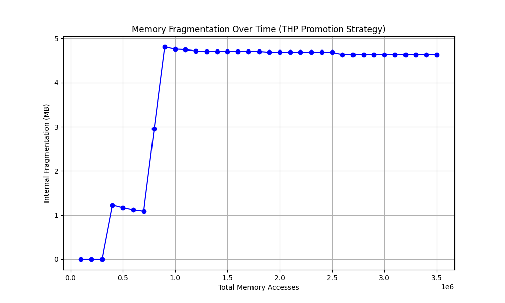

# Cycle-Accurate TLB Hierarchy Simulator with THP Promotion

A high-performance systems-level simulator implemented in Rust designed to analyze the performance-overhead trade-offs of Transparent Huge Page (THP) promotion heuristics. This project quantifies the Space-Time Paradox of memory management: how increasing translation reach through coarse-grained allocation (2MB Huge Pages) impacts both Average Memory Access Time (AMAT) and internal fragmentation.

---

## Project Motivation & Research Context
Modern OS kernels utilize Huge Pages to reduce TLB misses and shorten the expensive hardware page table walk. However, promoting a region to a Huge Page is not "free." This simulator was developed to study the Invalidation Paradox: the phenomenon where the latency penalty of clearing existing 4KB mappings to make room for a Huge Page can occasionally outweigh the hit-rate benefits for specific workloads.


---

## Tech Stack & Methodology
* **Language**: Rust — Selected for zero-cost abstractions and memory safety, essential for cycle-accurate simulation.
* **Trace Generation**: Valgrind (Lackey) — Used to capture real-world memory access patterns (Instruction, Load, Store, Modify).
* **Analysis**: Python (Matplotlib) — Used to parse simulation logs and visualize fragmentation dynamics.
* **Replacement Policy**: Least Recently Used (LRU) — Implemented via a global timer to maintain temporal locality.

---

## Architecture & Promotion Logic

### TLB Hierarchy Configuration
* **L1 Instruction (L1I)**: 16 sets, 4-way associative, 1-cycle latency.
* **L1 Data (L1D)**: 16 sets, 4-way associative, 1-cycle latency.
* **L2 Unified**: 128 sets, 8-way associative, 10-cycle latency.

### Promotion Heuristic
The simulator monitors 2MB virtual regions via a HashMap-based sparse tracker. When a region reaches a threshold of unique 4KB page touches, the simulator:
1. Invalidates specific 4KB entries across the hierarchy to prevent aliasing.
2. Promotes the region to a 2MB Huge Page.
3. Calculates Internal Fragmentation based on the delta between physical footprint and actual usage.


---

## Sensitivity Analysis: The Promotion Threshold (T)
Analysis conducted over a trace of 3.5 million memory accesses using an automated benchmarking pipeline:

| Threshold (T) | Huge Pages | Huge Hits | Frag (MB) | AMAT (Cycles) |
| :--- | :--- | :--- | :--- | :--- |
| **16 (Aggressive)** | 306 | 74,669 | 610.64 | 1.2954 |
| **32** | 33 | 73,622 | 64.64 | 1.0691 |
| **64 (Balanced)** | 3 | 59,311 | 4.64 | 1.0239 |
| **128** | 1 | 22,877 | 0.64 | 1.0227 |
| **256 (Baseline)** | 0 | 0 | 0.00 | **1.0212** |

### Key Architectural Insights
* **The Invalidation Penalty**: The data reveals that the lowest AMAT (1.0212) occurs at the baseline. This suggests that for this specific workload, the overhead of clearing TLB entries to promote to a Huge Page is higher than the translation benefit.
* **Fragmentation Scaling**: Reducing the threshold from 64 to 16 increases Huge Page hits by only ~25%, while exploding internal fragmentation by over 13,000% (4.64 MB to 610.64 MB).
* **Optimal Heuristic**: A threshold of 64 provides the most architectural value for this workload, capturing the highest "Hit-per-MB" density.

### Dynamic Fragmentation Analysis (T=64)
The "Sawtooth" behavior below illustrates the policy's reaction. Spikes represent new 2MB promotions, while the subsequent downward slopes represent the workload "filling in" the Huge Page, thereby increasing utilization.




---

## How to Run
1. **Generate Trace**:
    ```bash
    valgrind --tool=lackey --trace-mem=yes grep -r "include" /usr/include > trace.txt 2>&1
    ```
2. **Run Sensitivity Benchmarks**:
    ```bash
    python benchmark.py
    ```
3. **Run Simulator**:
    ```bash
    cargo run --release > simulation_log.txt
    ```

---

## Future Research Directions
* **Huge Page Demotion Logic**: Implement a decay-based aging mechanism to "split" Huge Pages back into 4KB entries if access density falls below a critical threshold.
* **Adaptive Thresholding**: Dynamically adjust the promotion threshold based on real-time system memory pressure or hit-rate feedback.
* **Multi-Core TLB Coherence**: Extend the hierarchy to support multiple cores, necessitating the simulation of TLB Shootdowns.
